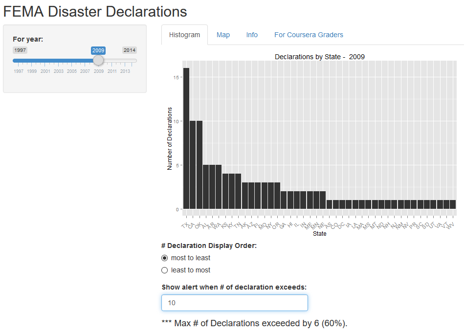

Occurance of FEMA Disaster Declarations by State
========================================================
author: Jerry Kurata
date: October 14, 2015

========================================================

# Application Features

Review FEMA Disaster Declarations by Year

Per state

User selectable year

User selectable display parameters

Alert when number of declaration exceeds used-defined threshold

========================================================

# User Interface

 *Map also available*
 
========================================================

# Data

Data is from OpenFEMA DataSet: Disaster Declaration Summaries

Because of potential inconsistencies of early data, data used is from 1997 or later

Data was cleaned up to remove null/incomplete records

After clean up there are currently 3361 declarations
**Number of declartions from embedded r code**

Original data found at: http://www.fema.gov/openfema-dataset-disaster-declarations-summaries-v1

=========================================================
# Summary of Tool

Quick and easy way to compare yearly number of disaster declarations

Easy to see relative counts of disaster declerations by state

Information presented as histogram and map

Future versions will include cost, declaration event type, and other comparisions

